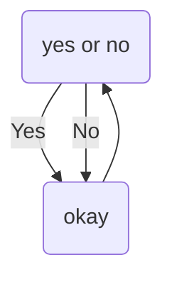

### Hi there 👋 I'm Andy

## Welcome to my Github Page :D

Favorite Languages: ✨Javasript✨ and ✨Python✨  
I'm more of an art guy than a code guy, but here I am either way!

  
  
  
  
  <!---
  for this wordle svg the width is 500px, but there is extra width when it is displayed in markdown
  when i set it to half the width (250px) it works fine and displays the proper full width no fluff
  not sure why, and 50% width doesn't work, but 25% kind of does... it has a smidge extra sliver of padding. idk, i will fix later.

  The SVG generate from the server must use a view box, that fixes the above problems. Now I can use width and height to fix in the markdown as i please
  -->
  
   
  
  
  

 

## todo
- add pie chart widget
- make twitter widget
- add glitch project so others can host their own widgets

