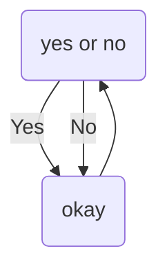

### Hi there 👋 I'm Andy
## Welcome to my Github Page :D

Favorite Languages: ✨Javasript✨ and ✨Python✨  
I'm more of an art guy than a code guy, but here I am either way!

  
   
  
   
  

 

## todo
- add pie chart widget
- fix no emojis problem for wordle display
- make twitter widget
- add glitch project so others can host their own widgets

